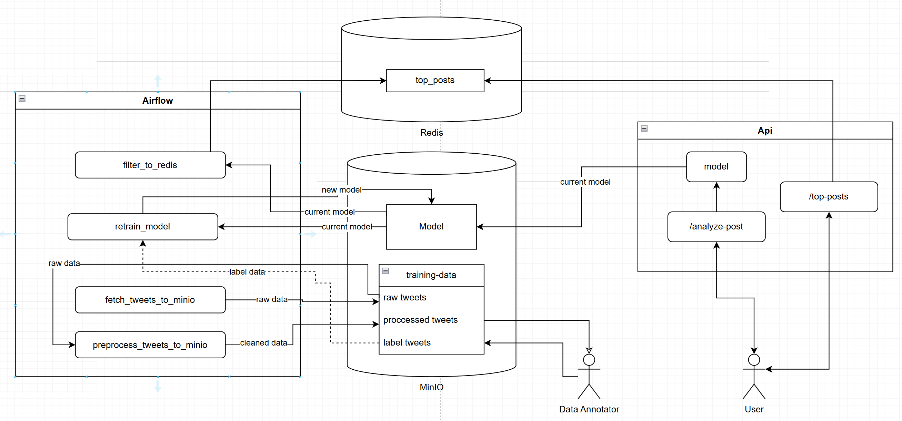

localhost:80 - API

localhost:8080 - Airflow - airflow/airflow

DAGs:
    fetch_tweets_to_minio - get tweets from X and save it to MinIo.
    preprocess_tweets_to_minio - clean tweets.
    retrain_model - get label_data, model from MinIo, retrain model, upload it back MinIo and clean up.
    filter_to_redis - get todays post, run through model and return withoud useless content.

API:
    POST localhost:8000/analyze-post -b {"body": "Social media post"}

localhost:9001 - MinIo - admin/admin123

ARCH

