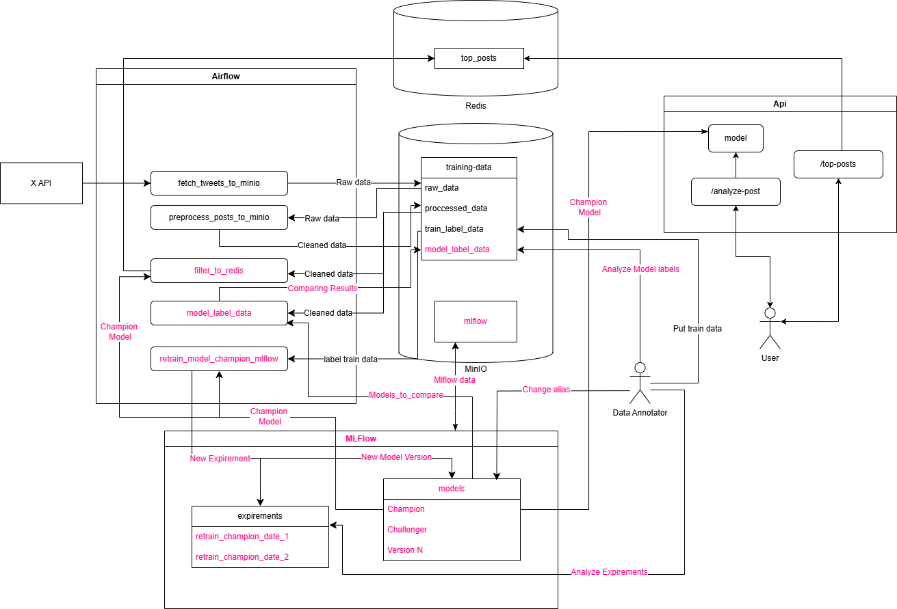

localhost:80 - API
localhost:9001 - MinIo - admin/admin123
localhost:8080 - Airflow - airflow/airflow
localhost:6379 - Redis

DAGs:
- fetch_tweets_to_minio - get tweets from X and save it to MinIo.
- preprocess_tweets_to_minio - clean tweets.
- retrain_model - get label_data, model from MLFLOW, retrain model, log and register new version of it back MLFLOW and clean up.
- model_label_data - get cleaned data, models to compare, run posts through models and compare labels.
- filter_to_redis - get todays post, run through model and return withoud useless content.

API:
    POST localhost:80/analyze-post -b {"body": "Social media post"}
    GET localhost:80/top-posts

ARCH

